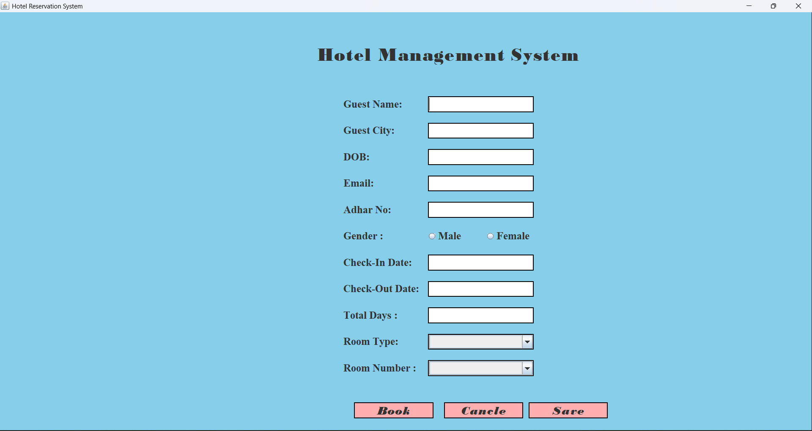
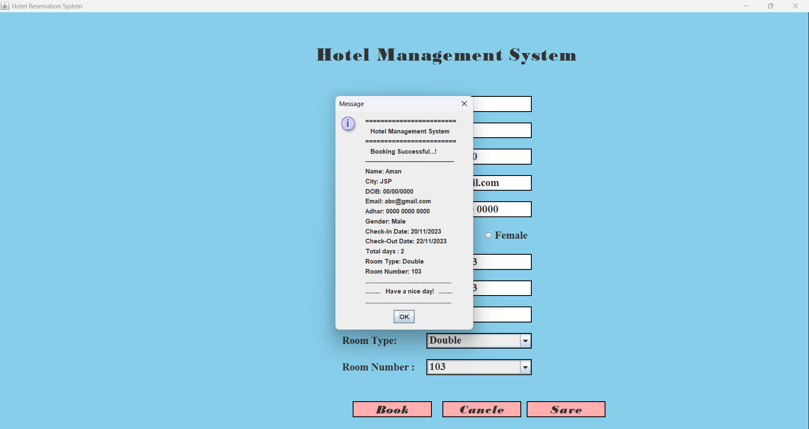

# Hotel Management System (Java + Swing)

A simple and user-friendly **Hotel Management System** built using Java Swing.  
This project provides an interactive GUI where hotel staff can register customers, select room types, record stay details, and manage hotel operations.  
It is a perfect beginner Java project that demonstrates GUI design, event handling, and modular code structure.

---

## 📸 Preview

---

## Preview 1

---

## Preview 2

---

## 📝 Features

- Customer information form (Name, Age, Mobile, Address)
- Room type selection (AC/Non-AC, Single/Double)
- Check-in / Check-out details
- GUI fully built using Java Swing components
- Action handling using `ActionListener`
- Clean and readable code structure
- **No database required by default** (runs offline)

---

## 🛠️ Technologies Used

- Java (JDK 8+)
- Java Swing & AWT  
- JFrame, JTextField, JComboBox, JRadioButton, JLabel, JButton  
- Event handling using ActionListener  

---

## ⚙️ Installation & Usage

### **1. Clone the Repository**
git clone https://github.com/amanchougule09/Hotel-Management-System---Java-Swing.git

### **2. Open in any Java IDE**
- VS Code  
- IntelliJ IDEA  
- Eclipse  

### **3. Compile & Run**
javac HotelManagementSystem.java
java HotelManagementSystem

## 🗄️ Optional: Database Installation (If You Add DB Later)

If you plan to connect your system with a database (like MySQL), follow these steps:

### **Conncet Database**
Create database in your machine and connect it with value present in code.

---

### Author

Aman Chougule

👨‍💻 Author
Aman
